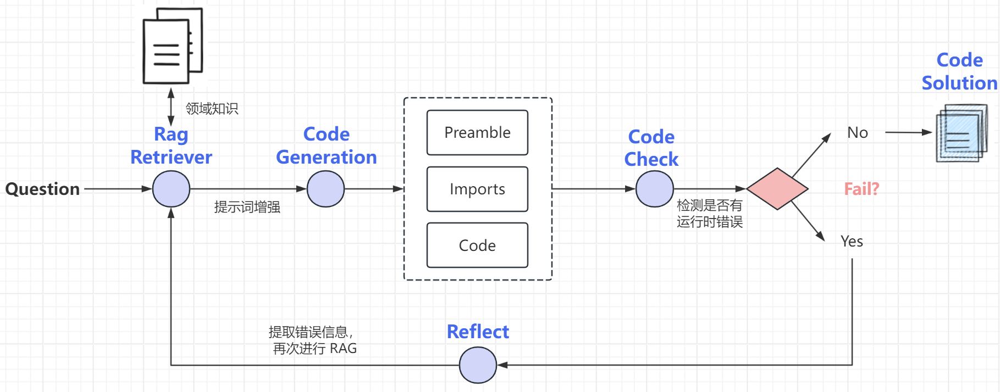
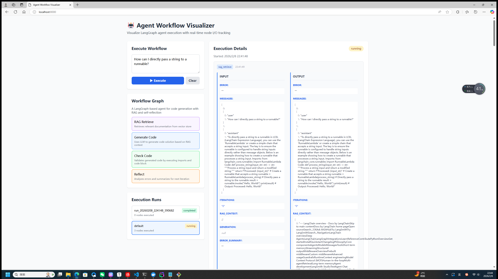
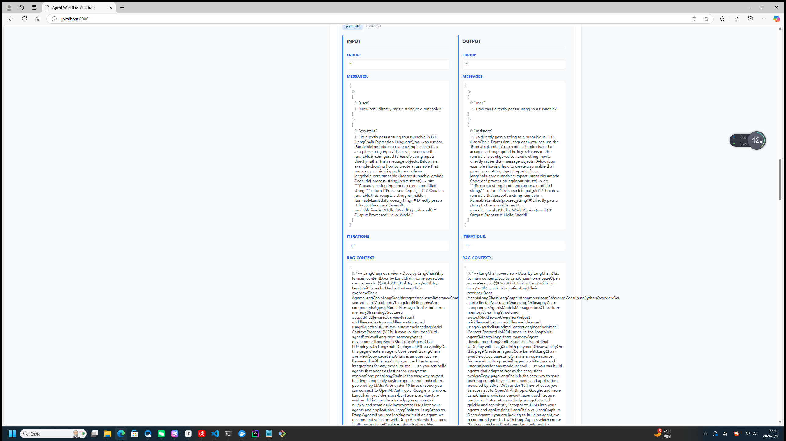

### WiseCard 项目 WiseCardPackage 卡片包自动生成项目的探索。

## 目标

通过 WiseCardPackage 的具体例子来自动化生成卡片包。

思路： Agent skill + RAG

其中 agent skill 复杂结合“思维链模式（CoT）” 来规定任务的具体流程，同时在 skill 的 resources 中添加具体的例子来让 LLM 学习。

使用 skill 的目的是为了**防止上下文被压缩**

RAG 通过搭建动态布局（DSL）的领域知识来让模型学习（在对话的生命周期中学习而不是长期学习）

后续可以结合 LangGraph 来达到自迭代的 agent 的效果。

## 参考项目

LangGraph 经典实战项目：https://github.com/langchain-ai/langgraph/blob/23961cff61a42b52525f3b20b4094d8d2fba1744/docs/docs/tutorials/code_assistant/langgraph_code_assistant.ipynb

知乎介绍：https://zhuanlan.zhihu.com/p/1976720013428819800

执行 python main.py 

(test.py 文件扔给 claude code 自动生成的 FastAPI 项目)

